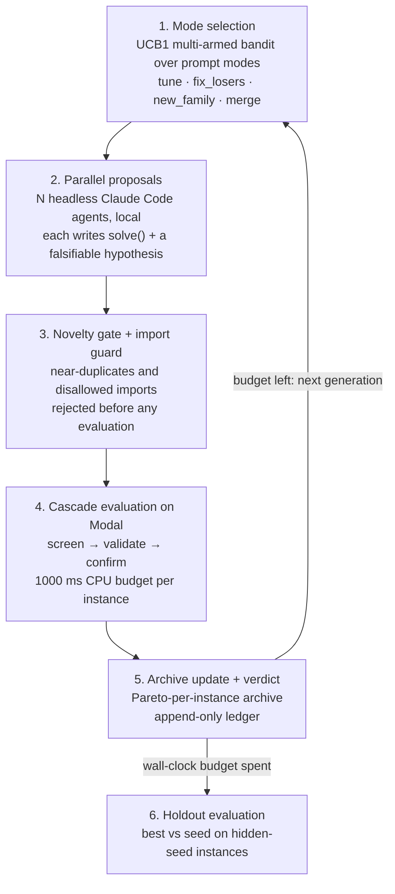

# Autoresearch optimizer

Shared workspace for building an autoresearch optimizer: propose algorithm changes, evaluate them against a reproducible baseline, and keep improvements with an experiment record.

This is our entry for **Track 1: AI Automated Discovery of Algorithms — Build Your Own Autoresearch Framework**. `median_string/` is the benchmark + evaluator (Median/Steiner string, lower total edit distance is better); `autoresearch/` is the research loop that drives it. Claim a workstream in [TASKS.md](TASKS.md).

## Get started

From the repository root, with `uv` and `just` installed:

```sh
just autoresearch-setup
just autoresearch-smoke
```

This workspace uses Python 3.11 and its own `.venv/`, `pyproject.toml`, and committed `uv.lock`. To add dependencies or run experiments, work inside this folder:

```sh
cd autoresearch-optimizer
uv sync --frozen
uv add <package>
uv run python scripts/<experiment>.py
```

Commit both `pyproject.toml` and `uv.lock` when changing dependencies.

## The autoresearch loop (`autoresearch/`)

The proposer is always a coding agent (Claude Code here; Codex or any agent that can edit files
works the same way). The loop owns evaluation and the ledger, so an agent can only *propose*.

### How a run works



1. **Mode selection (multi-armed bandit).** Each prompt mode is an arm of a UCB1 bandit.
   - **Reward:** 1 for a confirmed new global best, 0.5 for a new best on some instance only.
   - **Allocation:** each generation's agents are split across the arms by UCB score, so modes
     that pay off get more agents while rarely-tried modes keep an exploration bonus.
   - **Plateau detector:** `tune` is switched off after a whole generation with no new best
     (after 4 flat proposals in single-agent mode).
   - **Merge:** offered only when the archive holds complementary solvers.
2. **Parallel proposals.** N headless Claude Code agents run per generation, each in its own
   workspace, each with a mode, a parent from the archive and a research direction. Agents see:
   - per-instance diagnostics;
   - the research ledger;
   - the falsified hypotheses;
   - a `./try` self-test that runs on Modal.

   Each writes one `solve(instance)` and a falsifiable hypothesis.
3. **Novelty gate + import guard.** Candidates are AST-normalised (comments and docstrings
   stripped, locals α-renamed) and compared with every earlier candidate, including those from
   the same generation. Near-duplicates and disallowed imports/calls are rejected without being
   evaluated.
4. **Cascade evaluation on Modal.** The cheap `screen` split runs first. Then comes `validate`
   (the objective), then `confirm` on fresh instances. Each candidate runs in its own Modal
   container, and a `SIGPROF` CPU timer enforces the per-instance budget.
5. **Archive update + verdict.**
   - **Pareto archive:** keeps the global best and every solver that is best on at least one instance.
   - **New global best:** must also not regress on the confirm split (a *confirmation re-test*),
     otherwise it is `unconfirmed`.
   - **Verdict:** every proposal gets one (`supported` / `partial` / `falsified` / `unconfirmed` /
     `inconclusive` / `untested`), recorded in the ledger. The next generation sees all of it.
6. **Holdout evaluation.** When the wall-clock budget can't fit another generation, the best
   solver and the seed are scored on a holdout split. Its seeds live in a Modal secret that only
   the evaluators read.

Watch it live with `just autoresearch-viz serve ...`.

### Exploration-exploitation layer (on by default; `--no-descriptors` turns it off)

A layer on top of the mode bandit, built on **descriptors** ([autoresearch/descriptors.py](autoresearch/descriptors.py)):
one cached LLM call tags each program with 1–10 terms from a shared, growing vocabulary. Exactly one
term is tier 6 (what the algorithm is); the others are tier 3 (structure) or tier 1 (detail).
Descriptor distance is a tier-weighted best-match cosine over centred MiniLM term embeddings, where
identical descriptors are at distance 0. The bandit still decides how many agents each mode gets.

- **`tune` = exploit (K):** refines the best elite of each of the top 3 distinct lineages under a
  descriptor contract (same algorithm and components, different hyperparameters and implementation
  detail). Only exact copies are rejected. A child whose descriptor drifts more than 0.3 from its
  parent's has changed strategy, so it is judged like a `new_family` candidate instead.
- **`new_family` = explore (L):** every candidate is described and evaluated only if its max-min
  descriptor distance to the elite archive (top 10 by objective) and to this round's picks is at least
  0.3. No extra agents are run. At most a third get a gap prompt: a paradigm and a structural term that
  both appear in strong solvers (global best, per-instance winners) but never together. The rest choose
  freely.
- **`fix_losers` and `merge`** keep their own focus.
- **Prompt context:** no agent gets the problem's hand-written research directions; every agent sees
  descriptor + one-line summary for the top 25 archive members.

`scripts/validate_descriptors.py` checks the descriptors themselves (self-distance test on the
solvers in `scripts/descriptor_fixtures/`, plus embedding sanity). The run directory also gets
`descriptors.json` and `vocab.json` (vocabulary size per generation).

### Problems

| Problem | Objective instances | Notes |
| --- | --- | --- |
| `median_string` (default) | four DNA instances of 280–688 bp (k = 20–40) + one 320 aa protein (k = 15), 25–38% substitutions, 5–10% indels | The 1000 ms budget binds: a naive search leaves ~9% on the table vs 10 s. The previous 20–43-char objective was solved (every agent solver landed on 511) and is retired |
| `median_string_long` | four 1500 bp DNA (k = 10–20, 10–30% substitutions, 2–8% indels) + one 500 aa protein | MSA-scale. long-1 (16 agents, 7 generations): seed 29,584 → 21,513 vs planted 21,612; the noisy instance still has ~1.8% headroom at 30 s |

Every run also has three reference points:
- the **set-median baseline**, which is the best input string;
- the **seed** solver;
- the **planted string** (`best_known`).

`init` also scores the classical non-agent solvers from `median_string/solvers` (`set_median`,
`frequency_consensus`, `template`) under the same CPU budget and writes them to `baselines.json`.
They appear as a table in `report.md` and the dashboard, and the dashboard also draws them as a
reference line.

`median_string.metrics.levenshtein_distance` uses rapidfuzz (C++, ~0.1 ms at 1500×1500), and
`levenshtein_editops` gives solvers optimal alignments. Pure-Python DP code is ~3000× slower and
cannot fit the budget at these sizes.

### Budgets

| Budget | Default | Where to change |
| --- | --- | --- |
| CPU per `solve()` call, per instance | **1000 ms**; over 1250 ms the instance is invalid | `swarm --budget-ms` (new run) / `config.json` |
| One agent session | **180 s** wall clock, then the agent is stopped and its last files are used | `swarm --turn-s` |
| Whole run | **20 min** wall clock; no new generation starts if one cannot finish | `swarm --budget-min` |
| Agents per generation | **32** | `swarm --agents` |
| Evaluation containers | up to 96 in parallel, 1 CPU each | `autoresearch/modal_eval.py` |

Solvers see their budget as `instance.time_budget_ms` and should return their best answer
before it runs out. The evaluator enforces it with a CPU timer (`SIGPROF`) that solver code
cannot catch with `except Exception`.

### Commands

```sh
# one-time: Modal login (uv run modal setup) and the hidden held-out seeds
uv run modal secret create autoresearch-heldout AUTORESEARCH_CONFIRM_SEED=<int> AUTORESEARCH_HOLDOUT_SEED=<int>

# from the repo root
just autoresearch-swarm-smoke                                   # 2 agents, 1 generation, ~1-2 min
just autoresearch-swarm --run artifacts/runs/swarm-1            # 32 agents/generation, 20 min
just autoresearch-swarm --run artifacts/runs/long-1 --problem median_string_long   # MSA-scale 1500 bp instances
just autoresearch-swarm --run artifacts/runs/swarm-1 --agents 8 --budget-min 10 --model opus
just autoresearch-swarm --run artifacts/runs/simple-1 --modes tune --exploit 1.0   # control: plain incumbent-only loop (no archive/merge/bandit)
just autoresearch-swarm --run artifacts/runs/plain-1 --no-descriptors   # control: bandit without the exploration-exploitation layer
just autoresearch-viz serve artifacts/runs/swarm-1 --open      # live dashboard (run in a second terminal)
just autoresearch-viz render artifacts/runs/swarm-1 artifacts/runs/simple-1 -o artifacts/viz/ablation.html   # offline comparison for the demo

# single-agent mode (tell the agent: "read autoresearch/program.md and start a research run")
just autoresearch --run artifacts/runs/demo init
just autoresearch --run artifacts/runs/demo status
just autoresearch --run artifacts/runs/demo try --file cand.py
just autoresearch --run artifacts/runs/demo submit --file cand.py --hypothesis "..." --mode fix_losers --parent 2
just autoresearch --run artifacts/runs/demo report --holdout
```

Set `AUTORESEARCH_EVAL=modal` to send single-agent `submit`/`try` evaluations to Modal too
(`uv run modal deploy -m autoresearch.modal_eval` first; the swarm deploys it itself).

A run directory `artifacts/runs/<name>/` holds:
- `ledger.jsonl`: hypothesis, parents, mode, status, verdict, per-instance scores, CPU ms, agent tokens and cost;
- `candidates/NNNN.py`;
- `events.jsonl`: swarm progress;
- `holdout.json`;
- `agents/`: each agent's Claude Code JSON output;
- `report.md`.

### What is hard about autoresearch, and what we did about it

Plain-English version. Each item is a known weakness of LLM-driven research loops (FunSearch,
AlphaEvolve, OpenEvolve, ShinkaEvolve, GEPA, AI-Scientist-style agents), followed by how this
loop handles it.

1. **A single score hides what went wrong.**
   - *The problem:* most loops tell the model "your solver scored 518", with no sign of which
     inputs it fails on or why.
   - *What we do:* every agent gets a per-instance table: its score against the simple baseline,
     against the planted answer, and against the best any candidate has reached on that input,
     plus CPU time and the input's properties (noise level, indels, alphabet). It must state a
     falsifiable hypothesis ("X because Y, expect lower score on Z") before it writes code.
2. **Models keep re-proposing the same idea.**
   - *The problem:* LLMs drift back to the obvious change, and every repeat costs tokens and compute.
   - *What we do:* a novelty gate compares each new solver with every earlier one, after stripping
     comments and renaming variables. Near-copies are rejected *before* any evaluation, including
     copies of what another agent proposed in the same generation. Each agent is also told what
     the other agents are working on, and that it should skip the most obvious next step.
3. **"Improvements" that are really luck.**
   - *The problem:* try hundreds of variants and some will win on the test set by chance.
   - *What we do:* a claimed new best must also hold up on a second set of fresh instances
     (*confirm*) before it counts; otherwise it is marked `unconfirmed`. Final numbers come from a
     *holdout* set the search never sees. On Modal, the seeds that generate those sets live in a
     secret only the evaluators can read, so an agent cannot regenerate them and hard-code answers.
4. **Good ideas get thrown away because they lose on average.**
   - *The problem:* keeping only the single best solver discards one that is excellent on some inputs.
   - *What we do:* a Pareto archive keeps every solver that is best on at least one instance. The
     `merge` mode hands an agent two such solvers and asks it to combine them.
5. **The loop doesn't know when to stop tweaking.**
   - *The problem:* without guidance, agents make small edits to the leader long after that has
     stopped paying off.
   - *What we do:* a bandit tracks which kind of request (`tune`, `fix_losers`, `new_family`,
     `merge`) has been producing gains and gives those modes more agents. After a run of proposals
     with no gain, `tune` is switched off so agents have to try something different.
6. **Unlimited compute makes results meaningless.**
   - *The problem:* with no time limit, brute force wins and the benchmark saturates. Our first
     solver already matched the planted answer everywhere.
   - *What we do:* every `solve()` call gets a hard 1000 ms CPU budget per instance. Agents must
     find algorithms that are both good and fast, which separates ideas far better.
7. **Agents can game their own evaluation.**
   - *The problem:* an agent that grades itself, or can read the test generator, can fake progress.
   - *What we do:*
     - agents only return source code; the harness evaluates it in a separate process or Modal container;
     - inside that evaluation, the candidate's code runs in its own process
       (`autoresearch/candidate_runner.py`) that receives only a copy of the strings, alphabet, metric,
       length constraint and CPU budget: no planted answer, no reference score, no generator seed, no
       `AUTORESEARCH_*` secrets. It returns one string per instance. Validation, distances and baselines
       are computed by the parent from its own copy of the inputs, so reading the answer, mutating the
       inputs or monkeypatching `median_string.metrics` cannot change a score
       (`scripts/test_autoresearch.py::test_evaluator_boundary` checks each of these);
     - an import guard blocks `os`, `subprocess`, the benchmark generator, `exec` and `open`: a readable
       check, not a security sandbox;
     - only the orchestrator writes the ledger, and `config.json` records an `evaluator_hash` so runs made
       with different evaluator versions are not compared by accident.
8. **Serial loops are slow.**
   - *The problem:* one agent at a time gives roughly one hypothesis a minute.
   - *What we do:* N agents work in parallel each generation, and every evaluation runs in its own
     Modal container. Generations stay in sync so each one builds on all previous results.
9. **Long runs forget and are hard to watch.**
   - *What we do:* the append-only ledger is the memory. Falsified hypotheses are fed back as
     "don't repeat this; build on why it failed". `events.jsonl` and the live dashboard show what
     every agent is doing while the run is in progress.

**Not solved yet:**
- Agents given the same evidence still tend to converge on similar ideas.
- Each generation waits for its slowest agent (capped by the turn limit).
- Modal CPUs are about 1.5x slower and noisier than a laptop, so a solver right at its budget can
  flip between valid and invalid.
- Many parallel sessions on a Claude subscription can hit usage limits.
- The reported dollar cost is Claude Code's own estimate.

Adding another problem means writing one class that implements `autoresearch/problem.py::Problem`
(`describe`, `seed_source`, `evaluate(source, split, budget_ms)`) and registering it in `PROBLEMS`.

Run the tests with `just autoresearch-test`.

## Layout

```text
autoresearch-optimizer/
  README.md         # setup, scope, and collaboration
  TASKS.md          # workstream ownership and next steps
  pyproject.toml    # workspace dependencies
  uv.lock           # reproducible dependency resolution
  autoresearch/     # research loop: propose -> novelty gate -> cascade eval -> archive -> ledger
  autoresearch_viz/ # live / static dashboard for runs (see below)
  median_string/    # benchmark, metrics, baseline solvers, evaluator
  scripts/          # runnable experiments and tests
  notebooks/        # exploration
  data/             # local inputs, ignored by Git
  artifacts/        # local results, ignored by Git
```

## Visualise runs (`autoresearch_viz/`)

A self-contained HTML dashboard: no network access is needed, so it also works offline in a demo.
It shows:
- a live "Now" panel: generation, agents back, elapsed time, cost, latest events;
- best objective against evaluations, agent tokens and wall clock, with the hypothesis behind
  every improvement;
- a scoreboard per run, including held-out gain;
- per-instance bars;
- the outcome mix of all proposals;
- the idea lineage: every proposal as a node in a parent → child graph by generation, coloured by outcome, verdict or mode,
  with the path to the final best highlighted (seed hidden by default, so independent lines of attack form separate trees);
- the trajectory, with each proposal's verdict.

```sh
just autoresearch-viz serve artifacts/runs/swarm-1 --open          # live: refreshes every 3 s during a run
just autoresearch-viz render artifacts/runs -o artifacts/viz/all.html   # static snapshot comparing all runs
```

## Work together

1. Claim an unowned task in [TASKS.md](TASKS.md), and agree on the benchmark and evaluation contract before implementing the search loop.
2. Start a feature branch from the latest `main`, for example `autoresearch/baseline` or `autoresearch/search-loop`.
3. Keep runnable code in `scripts/` and exploration in `notebooks/`. Load relevant shared science skills from the repository's `.agents/skills/` when useful.
4. For every experiment, record the objective, baseline, candidate, seed, data split, compute budget, elapsed time, score, and source commit. Save raw outputs in `artifacts/`; include a concise result summary and reproduction command in the PR.
5. Open a focused PR and get a teammate's approval before merging. Keep credentials and participant-only access codes in local environment variables or an ignored `.env` file.

## Hackathon deliverables

From the organizer information shared with the team:

- Build during the event and credit reused libraries, APIs, and pretrained models.
- Prepare a two-minute project demo, the GitHub repository link, and a short description.
- Submit code and demos by **Sunday, 4 October 2026 at 14:45 BST**.
- Plan the first-round presentation: 1:30 pitch, 1:30 live demo, and 2:00 Q&A.
- Show novelty, performance, interpretability, and ease of use for the autoresearch challenge.

Event information: [Iterate AI x Science Hackathon](https://iterate.inc/london-ai-science).
