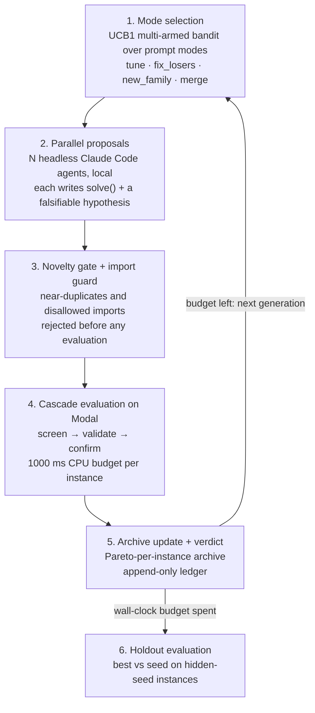

# Autoresearch optimizer

Shared workspace for building an autoresearch optimizer: propose algorithm changes, evaluate them against a reproducible baseline, and keep improvements with an experiment record.

This is our entry for **Track 1: AI Automated Discovery of Algorithms — Build Your Own Autoresearch Framework**. `median_string/` is the benchmark + evaluator (Median/Steiner string, lower total edit distance is better); `autoresearch/` is the research loop that drives it. Claim a workstream in [TASKS.md](TASKS.md).

## Get started

From the repository root, with `uv` and `just` installed:

```sh
just autoresearch-setup
just autoresearch-smoke
```

This workspace uses Python 3.11 and its own `.venv/`, `pyproject.toml`, and committed `uv.lock`. To add dependencies or run experiments, work inside this folder:

```sh
cd autoresearch-optimizer
uv sync --frozen
uv add <package>
uv run python scripts/<experiment>.py
```

Commit both `pyproject.toml` and `uv.lock` when changing dependencies.

## The autoresearch loop (`autoresearch/`)

The proposer is always a coding agent (Claude Code here; Codex or any agent that can edit files
works the same way). The loop owns evaluation and the ledger, so an agent can only *propose*.

### How a run works



1. **Mode selection (multi-armed bandit).** Each prompt mode is an arm of a UCB1 bandit.
   - **Reward:** 1 for a confirmed new global best, 0.5 for a new best on some instance only.
   - **Allocation:** each generation's agents are split across the arms by UCB score, so modes
     that pay off get more agents while rarely-tried modes keep an exploration bonus.
   - **Plateau detector:** `tune` is switched off after a whole generation with no new best
     (after 4 flat proposals in single-agent mode).
   - **Merge:** offered only when the archive holds complementary solvers.
2. **Parallel proposals.** N headless Claude Code agents run per generation, each in its own
   workspace, each with a mode, a parent from the archive and a research direction. Agents see:
   - per-instance diagnostics;
   - the research ledger;
   - the falsified hypotheses;
   - a `./try` self-test that runs on Modal.

   Each writes one `solve(instance)` and a falsifiable hypothesis.
3. **Novelty gate + import guard.** Candidates are AST-normalised (comments and docstrings
   stripped, locals α-renamed) and compared with every earlier candidate, including those from
   the same generation. Near-duplicates and disallowed imports/calls are rejected without being
   evaluated.
4. **Cascade evaluation on Modal.** The cheap `screen` split runs first. Then comes `validate`
   (the objective), then `confirm` on fresh instances. Each candidate runs in its own Modal
   container, and a `SIGPROF` CPU timer enforces the per-instance budget.
5. **Archive update + verdict.**
   - **Pareto archive:** keeps the global best and every solver that is best on at least one instance.
   - **New global best:** must also not regress on the confirm split (a *confirmation re-test*),
     otherwise it is `unconfirmed`.
   - **Verdict:** every proposal gets one (`supported` / `partial` / `falsified` / `unconfirmed` /
     `inconclusive` / `untested`), recorded in the ledger. The next generation sees all of it.
6. **Holdout evaluation.** When the wall-clock budget can't fit another generation, the best
   solver and the seed are scored on a holdout split. Its seeds live in a Modal secret that only
   the evaluators read.

Watch it live with `just autoresearch-viz serve ...`.

### Exploration-exploitation layer (on by default; `--no-descriptors` turns it off)

A layer on top of the mode bandit, built on **descriptors** ([autoresearch/descriptors.py](autoresearch/descriptors.py)):
one cached LLM call tags each program with 1–10 terms from a shared, growing vocabulary. Exactly one
term is tier 6 (what the algorithm is); the others are tier 3 (structure) or tier 1 (detail).
Descriptor distance is a tier-weighted best-match cosine over centred MiniLM term embeddings, where
identical descriptors are at distance 0. The bandit still decides how many agents each mode gets.

- **`tune` = exploit (K):** refines the best elite of each of the top 3 distinct lineages under a
  descriptor contract (same algorithm and components, different hyperparameters and implementation
  detail). Only exact copies are rejected. A child whose descriptor drifts more than 0.3 from its
  parent's has changed strategy, so it is judged like a `new_family` candidate instead.
- **`new_family` = explore (L):** every candidate is described and evaluated only if its max-min
  descriptor distance to the elite archive (top 10 by objective) and to this round's picks is at least
  0.3. No extra agents are run. At most a third get a gap prompt: a paradigm and a structural term that
  both appear in strong solvers (global best, per-instance winners) but never together. The rest choose
  freely.
- **`fix_losers` and `merge`** keep their own focus.
- **Prompt context:** no agent gets the problem's hand-written research directions; every agent sees
  descriptor + one-line summary for the top 25 archive members.

`scripts/validate_descriptors.py` checks the descriptors themselves (self-distance test on the
solvers in `scripts/descriptor_fixtures/`, plus embedding sanity). The run directory also gets
`descriptors.json` and `vocab.json` (vocabulary size per generation), and `describe_usage.jsonl`
(spend of the describe calls, which is not part of the agents' `cost_usd`).

### Benchmark: initial vs exploration-exploitation vs this branch

`scripts/bench.sh TAG` (or `just autoresearch-bench TAG`) runs three arms on the same problems, model
and seeds: `initial` (main at the layer's merge base, `c4438c4`), `johann` (tag `bench-johann`: the
layer plus only the cache-deadlock fix and describe-cost logging) and `mine` (this branch's HEAD;
commit before running). Each arm runs from a frozen worktree of its commit under
`../iterate-futurebiohackers-bench/`, refs resolved once at start; runs are sequential, arms
interleaved per seed, and finished runs are skipped. Defaults: Sonnet, 8 agents x 3 generations,
seeds 0 1 2, `median_string`, overridable with `MODEL`, `AGENTS`, `GENERATIONS`, `SEEDS`, `PROBLEMS`,
`ARMS` (`name=ref[,flags]`); `DRY_RUN=1` prints the plan. `scripts/bench_report.py TAG` writes
`artifacts/bench/TAG.md`: per arm, mean ± sd of the gain and the held-out gain, the held-out
difference to `initial` with its standard error, cost including describe calls, wall-clock, and
proposals the descriptor gate dropped unevaluated.

### Diversity extension: families, distances, entropy and a minimal budget per family (all off by default)

Goal: better best solutions at a given budget, by not collapsing early onto one approach, not paying twice
for the same proposal, and giving an initially weaker approach a real chance to improve by refinement.
Three signals keep separate jobs: a **distance** estimates how different two programs (or plans) are; an
**entropy** describes how families are spread in a precisely defined set; **score progress** says whether a
family still benefits from more tries. A large distance does not make a solution promising, a high entropy
does not make families relevant, and a small distance does not mean equal behaviour or performance.

**Reference fixes (every configuration, including the reference arm).** The describe cache
([json_cache.py](autoresearch/json_cache.py)) holds a thread lock and an `fcntl` lock per read-modify-write
(no lost update across threads or processes), writes atomically, and never holds a lock during an LLM
call; keys hash the code fingerprint, backend, model, prompt, system prompt, schema, problem text and
the vocabulary version. Every auxiliary call ([llm_calls.py](autoresearch/llm_calls.py)) is logged to
`llm_usage.jsonl` (kind, model, seconds, the provider's token categories, cost; an unreported cost is
`null`, never 0) and runs from the temp dir (inside the repo `claude` also loads `CLAUDE.md`: 1374 vs
615 input tokens). An agent session that wrote nothing is kept as a `no_output` entry (its cost and its
try used to vanish), and the bandit counts every session as a try of its mode: duplicates, guard
rejections, gate drops and empty sessions are zero-gain tries (no benchmark score is invented for them;
`--legacy-bandit-counting` restores the old counting). Run-level caps `--max-run-usd`, `--max-run-calls`,
`--max-run-tokens` ([budget.py](autoresearch/budget.py)) reserve the estimated cost of a generation's
sessions and of every describe/plan call in flight before starting them.

**Program, lineage, family, proposal** ([families.py](autoresearch/families.py)). A *program* is a ledger
entry. A *lineage* follows genealogy only (first parent; a `new_family` proposal founds one). A *family* is
the canonical paradigm id of the program's signature: the LLM describes the code with ids of a frozen
vocabulary ([vocab/median_string_v1.json](autoresearch/vocab/median_string_v1.json): 14 paradigms, 30
mechanisms, 9 details, each with a definition and synonyms, built from the seed, the classical solvers,
the descriptor fixtures, the problem's directions and 342 earlier agent proposals); the code maps it to ids
and assigns the family. Hybrids get one principal paradigm (what produces the returned string / uses most of
the budget) plus mechanism tags. A paradigm outside the vocabulary becomes `provisional:<name>`: kept
apart from every other provisional family and never granted the new-family budget. A rewording maps to the
same id, so it cannot buy a new family. Limits: the classification is as coarse as the paradigm list (every
vote-guided descent is `local_search`), and many genuinely different programs share a signature.

**Distances** ([distance.py](autoresearch/distance.py)), one interface (value, nearest neighbour,
contributing terms, metric version, availability): `weighted_jaccard` (default, interpretable),
`d(A,B) = 1 - Σ min(wA, wB) / Σ max(wA, wB)` over canonical terms with role weights paradigm 6, mechanism 3,
detail 1, unknown term 1; and `minilm`, Johann's distance (audited: centred embeddings are re-normalised and
cosines clipped to [0, 1], so it is already in [0, 1] and symmetric; no rescaling). A missing or empty
signature is *unavailable*, never a duplicate; exact duplication stays with the code novelty gate.
**Thresholds are not calibrated yet**: `--archive-threshold` / `--batch-threshold` default to none, strict
rejection refuses to start without one, and the 0.116 / 0.18 / 0.3 values of other metrics are not reused.
`scripts/calibrate_distance.py` builds the pairs (redescriptions, renamings and parameter changes by
controlled transformation; curated same-family / paradigm-change fixture pairs; optional parent/child
pairs from `--runs`), splits dev/test by source program and reports the distributions, a suggested repeat
threshold, missed repeats, distinct programs rejected and useful improvements a filter would have blocked.

**Entropy and stagnation.** `H = -Σ p log p` (natural log) of the families of the top-k programs
(concentration of the best) and of the last `--allocation-window` finished tries (effort; rejected and
empty tries included). Empty set: H = 0 with `empty`; normalised H uses `log(min(k, number of vocabulary
paradigms))` and is undefined when that is ≤ 1; counts and `exp(H)` are logged. Stagnation is the global
best not improving for `--stagnation-generations`; a family's own stagnation counts its own tries.

**Policies** ([scheduler.py](autoresearch/scheduler.py)); the UCB bandit still allocates the four modes, each
policy only rewrites slots it already allocated (budget moved, never added), at most `max_override_fraction`
of them together, and every change is logged next to the bandit's `ucb_mode`:
- `--family-grace`: a new admissible family (valid first program, not provisional, not known at the start,
  budget left for one refinement) gets funded `tune` refinements of its best program: at least
  `--grace-min` 2 evaluations, +1 per record that beats the previous one by more than `--grace-epsilon`
  (90 objective units: just above the 88 re-scoring range measured on validate,
  `scripts/measure_eval_noise.py`), +`--grace-patience` 1 without progress, at most `--grace-max` 6.
  Every funded try counts, also invalid ones, so failing families lose it; expiry is final (a rename,
  a new lineage or a return from dormancy never renews it); at most `--max-protected` 2 at once, oldest
  obligation first. Progress is `max(0, record_before - new)` in objective units (no division by a score).
- `--entropy-controller`: when the top-k is concentrated (one family, or normalised H ≤ 0.5) **and** the
  best stagnates, a quarter of the slots refine under-explored families or ask for a new approach; off again
  on a new best or once normalised H > 0.7. A family already tried a lot without progress is skipped.
- `--diverse-parents`: tune parents are good (within 5% of the best) *and* different (greedy max-min on the
  distance); merges prefer the most distant complementary member and untried pairs; two slots on one parent
  get different mechanisms to work on.
- `--distance-policy observe|soft|strict` (after the code is written; the code's description is the one the
  archive keeps): `new_family` is compared with family representatives (dormant ones included) and with the
  batch; `tune` closeness is expected and a large distance is only logged as a mode drift; `merge` is
  flagged when the same pair repeats a combination; `fix_losers` is never judged on descriptors. `soft` also
  shows `new_family` agents the family landscape. Convention: too close ⟺ distance < threshold.
- `--plan-first` ([planner.py](autoresearch/planner.py)): one structured plan call per task before its
  session, checked against representatives and the batch's reserved plans, regenerated with the neighbour
  and the dimension to change (at most `--max-regenerations` 2, same mode), reserved atomically; a
  persistent repeat is handed back and its agent is not run. Plan calls are logged as `kind=plan`.
- `--family-diagnostics`: describe candidates for the family statistics with every policy off; logged as
  `describe:diagnostic` and excluded from the run's money cap.

Everything is reconstructible from the run directory: `schedule` events (bandit decision, overrides with
reasons, protections, controller state, entropies), `distance_gate`, `families`, `plan`, `mode_drift`,
`plan_divergence` events, each entry's `usage` (signature, family, parent family, lineage, target family,
override, grace counters, distance decision with neighbour, metric, version and threshold) and
`llm_usage.jsonl`. With every option off the run is the reference (tested: no describe call, no event).
Johann's layer (`descriptors`) and this scheduler are separate arms and refuse to be combined.

**Protocol** (`scripts/bench_policies.sh TAG`): A reference, B distance only (`--distance-policy soft
--diverse-parents`), C entropy + grace, D = B + C, all on one commit with the same seeds, model, agents,
per-session cap and run-level money cap (`MAX_RUN_USD`, default 3, which includes describe/plan calls);
`WITH_SPLIT=1` adds grace-only and controller-only arms (C alone cannot say which part helps),
`WITH_JOHANN=1` adds Johann's layer. Prompt differences between arms: B/D add the family landscape to
`new_family` agents and a mechanism focus when two agents share a parent; grace and controller slots carry a
short note naming their family or the untried paradigms. `scripts/bench_report.py TAG --html --target-gain
G` (fix G before the runs) writes Markdown, JSON, CSV and an HTML page: best gain vs cumulative spend and vs
wall-clock for every seed, tries and spend per family, top-k entropy per generation, family records with the
funded tries, the calibration distributions (`--calibration`) and a decision log.

```bash
uv run python scripts/test_diversity.py                         # offline tests (fake LLM at the subprocess boundary)
uv run python scripts/offline_world.py --tag offline            # synthetic A-D runs through the real loop (not measurements)
uv run python scripts/bench_report.py offline --html --target-gain 8
uv run python scripts/measure_eval_noise.py                     # evaluator noise (local CPU, free)
uv run python scripts/calibrate_distance.py --dry-run           # pairs and number of describe calls; drop --dry-run to pay for it
just autoresearch-swarm --run artifacts/runs/div-smoke --agents 2 --generations 1 --eval local --model haiku \
  --no-descriptors --family-grace --entropy-controller --distance-policy observe --max-run-usd 0.5   # paid smoke test
MAX_RUN_USD=3 SEEDS="0 1 2" scripts/bench_policies.sh div1      # paid benchmark: 4 arms x 3 seeds
uv run python scripts/bench_report.py div1 --html --target-gain 17
```

**First calibration (2026-10-04, Sonnet describer, vocabulary v1, $1.88 for 198 calls; JSON/MD under
`artifacts/calibration/`, local only).** 133-149 pairs, dev/test split by source program:

| metric | redescription max (dev / test) | same family (curated) | paradigm change min (dev / test) | suggested repeat threshold | test: missed repeats / distinct rejected |
|---|---|---|---|---|---|
| canonical + weighted Jaccard | 0.25 / 0.125 | 0.00-0.41 | 0.71 / 0.62 | **0.56** | 0/21, 0/42 |
| Johann's descriptor + MiniLM | 0.02 / 0.35 | 0.11-0.34 | 0.50 / 0.41 | 0.32 | 4/21, 0/42 |
| Johann's descriptor mapped to ids + weighted Jaccard | 0.05 / 1.00 | 0.18-1.00 | 0.70 / 0.66 | 0.51 | 5/21, 0/42 |

The closed vocabulary makes re-descriptions far more stable than free terms. Real parent/child pairs
from the smoke run (canonical): improving `tune` children 0.17-0.36, other `tune` 0.10-0.61, `new_family`
children 0.49-0.71, merges 0.39-0.71 — so 0.56 separates "same algorithm, other mechanisms" from "another
paradigm", it would block every improving tune (which is why `tune` is never rejected on descriptors) and
it would also drop some genuine `new_family` children. The improving pairs all fell on the dev side, so
"useful improvements blocked" on test is still unknown; the sample is small. The defaults stay `None`;
pass `--archive-threshold 0.56` deliberately for soft/strict runs with the canonical backend.

**Running on an API key** (another account or workspace): `scripts/with_api_key.sh <command>` (or `--check` for a
one-call test). With a claude.ai login present, `claude -p` ignores `ANTHROPIC_API_KEY` and keeps the login; the
wrapper uses an isolated config dir (`~/.claude-apikey`, no login) whose only setting is an `apiKeyHelper` that
prints `$AR_ANTHROPIC_KEY`, so every agent, describe and plan call uses the key, which is never written to disk.
Use a key scoped to a workspace (an organisation-level key needs an `anthropic-workspace-id` header).

Limits: thresholds come from one small calibration (above), so B uses distances for selection and
logging, not rejection, unless a threshold is passed; the savings of `--plan-first` are not demonstrated (it costs one call
per task); the vocabulary is fixed per version (`median_string-v1`) and coarse; families come from an LLM
reading the code and are not ground truth; with 3-5 seeds results are a first signal, not significance.

### Problems

| Problem | Objective instances | Notes |
| --- | --- | --- |
| `median_string` (default) | four DNA instances of 280–688 bp (k = 20–40) + one 320 aa protein (k = 15), 25–38% substitutions, 5–10% indels | The 1000 ms budget binds: a naive search leaves ~9% on the table vs 10 s. The previous 20–43-char objective was solved (every agent solver landed on 511) and is retired |
| `median_string_long` | four 1500 bp DNA (k = 10–20, 10–30% substitutions, 2–8% indels) + one 500 aa protein | MSA-scale. long-1 (16 agents, 7 generations): seed 29,584 → 21,513 vs planted 21,612; the noisy instance still has ~1.8% headroom at 30 s |

Every run also has three reference points:
- the **set-median baseline**, which is the best input string;
- the **seed** solver;
- the **planted string** (`best_known`).

`init` also scores the classical non-agent solvers from `median_string/solvers` (`set_median`,
`frequency_consensus`, `template`) under the same CPU budget and writes them to `baselines.json`.
They appear as a table in `report.md` and the dashboard, and the dashboard also draws them as a
reference line.

`median_string.metrics.levenshtein_distance` uses rapidfuzz (C++, ~0.1 ms at 1500×1500), and
`levenshtein_editops` gives solvers optimal alignments. Pure-Python DP code is ~3000× slower and
cannot fit the budget at these sizes.

### Budgets

| Budget | Default | Where to change |
| --- | --- | --- |
| CPU per `solve()` call, per instance | **1000 ms**; over 1250 ms the instance is invalid | `swarm --budget-ms` (new run) / `config.json` |
| One agent session | **180 s** wall clock, then the agent is stopped and its last files are used | `swarm --turn-s` |
| Whole run | **20 min** wall clock; no new generation starts if one cannot finish | `swarm --budget-min` |
| Agents per generation | **32** | `swarm --agents` |
| Evaluation containers | up to 96 in parallel, 1 CPU each | `autoresearch/modal_eval.py` |

Solvers see their budget as `instance.time_budget_ms` and should return their best answer
before it runs out. The evaluator enforces it with a CPU timer (`SIGPROF`) that solver code
cannot catch with `except Exception`.

### Commands

```sh
# one-time: Modal login (uv run modal setup) and the hidden held-out seeds
uv run modal secret create autoresearch-heldout AUTORESEARCH_CONFIRM_SEED=<int> AUTORESEARCH_HOLDOUT_SEED=<int>

# from the repo root
just autoresearch-swarm-smoke                                   # 2 agents, 1 generation, ~1-2 min
just autoresearch-swarm --run artifacts/runs/swarm-1            # 32 agents/generation, 20 min
just autoresearch-swarm --run artifacts/runs/long-1 --problem median_string_long   # MSA-scale 1500 bp instances
just autoresearch-swarm --run artifacts/runs/swarm-1 --agents 8 --budget-min 10 --model opus
just autoresearch-swarm --run artifacts/runs/simple-1 --modes tune --exploit 1.0   # control: plain incumbent-only loop (no archive/merge/bandit)
just autoresearch-swarm --run artifacts/runs/plain-1 --no-descriptors   # control: bandit without the exploration-exploitation layer
just autoresearch-viz serve artifacts/runs/swarm-1 --open      # live dashboard (run in a second terminal)
just autoresearch-viz render artifacts/runs/swarm-1 artifacts/runs/simple-1 -o artifacts/viz/ablation.html   # offline comparison for the demo

# single-agent mode (tell the agent: "read autoresearch/program.md and start a research run")
just autoresearch --run artifacts/runs/demo init
just autoresearch --run artifacts/runs/demo status
just autoresearch --run artifacts/runs/demo try --file cand.py
just autoresearch --run artifacts/runs/demo submit --file cand.py --hypothesis "..." --mode fix_losers --parent 2
just autoresearch --run artifacts/runs/demo report --holdout
```

Set `AUTORESEARCH_EVAL=modal` to send single-agent `submit`/`try` evaluations to Modal too
(`uv run modal deploy -m autoresearch.modal_eval` first; the swarm deploys it itself).

A run directory `artifacts/runs/<name>/` holds:
- `ledger.jsonl`: hypothesis, parents, mode, status, verdict, per-instance scores, CPU ms, agent tokens and cost;
- `candidates/NNNN.py`;
- `events.jsonl`: swarm progress;
- `holdout.json`;
- `agents/`: each agent's Claude Code JSON output;
- `report.md`.

### What is hard about autoresearch, and what we did about it

Plain-English version. Each item is a known weakness of LLM-driven research loops (FunSearch,
AlphaEvolve, OpenEvolve, ShinkaEvolve, GEPA, AI-Scientist-style agents), followed by how this
loop handles it.

1. **A single score hides what went wrong.**
   - *The problem:* most loops tell the model "your solver scored 518", with no sign of which
     inputs it fails on or why.
   - *What we do:* every agent gets a per-instance table: its score against the simple baseline,
     against the planted answer, and against the best any candidate has reached on that input,
     plus CPU time and the input's properties (noise level, indels, alphabet). It must state a
     falsifiable hypothesis ("X because Y, expect lower score on Z") before it writes code.
2. **Models keep re-proposing the same idea.**
   - *The problem:* LLMs drift back to the obvious change, and every repeat costs tokens and compute.
   - *What we do:* a novelty gate compares each new solver with every earlier one, after stripping
     comments and renaming variables. Near-copies are rejected *before* any evaluation, including
     copies of what another agent proposed in the same generation. Each agent is also told what
     the other agents are working on, and that it should skip the most obvious next step.
3. **"Improvements" that are really luck.**
   - *The problem:* try hundreds of variants and some will win on the test set by chance.
   - *What we do:* a claimed new best must also hold up on a second set of fresh instances
     (*confirm*) before it counts; otherwise it is marked `unconfirmed`. Final numbers come from a
     *holdout* set the search never sees. On Modal, the seeds that generate those sets live in a
     secret only the evaluators can read, so an agent cannot regenerate them and hard-code answers.
4. **Good ideas get thrown away because they lose on average.**
   - *The problem:* keeping only the single best solver discards one that is excellent on some inputs.
   - *What we do:* a Pareto archive keeps every solver that is best on at least one instance. The
     `merge` mode hands an agent two such solvers and asks it to combine them.
5. **The loop doesn't know when to stop tweaking.**
   - *The problem:* without guidance, agents make small edits to the leader long after that has
     stopped paying off.
   - *What we do:* a bandit tracks which kind of request (`tune`, `fix_losers`, `new_family`,
     `merge`) has been producing gains and gives those modes more agents. After a run of proposals
     with no gain, `tune` is switched off so agents have to try something different.
6. **Unlimited compute makes results meaningless.**
   - *The problem:* with no time limit, brute force wins and the benchmark saturates. Our first
     solver already matched the planted answer everywhere.
   - *What we do:* every `solve()` call gets a hard 1000 ms CPU budget per instance. Agents must
     find algorithms that are both good and fast, which separates ideas far better.
7. **Agents can game their own evaluation.**
   - *The problem:* an agent that grades itself, or can read the test generator, can fake progress.
   - *What we do:*
     - agents only return source code; the harness evaluates it in a separate process or Modal container;
     - inside that evaluation, the candidate's code runs in its own process
       (`autoresearch/candidate_runner.py`) that receives only a copy of the strings, alphabet, metric,
       length constraint and CPU budget: no planted answer, no reference score, no generator seed, no
       `AUTORESEARCH_*` secrets. It returns one string per instance. Validation, distances and baselines
       are computed by the parent from its own copy of the inputs, so reading the answer, mutating the
       inputs or monkeypatching `median_string.metrics` cannot change a score
       (`scripts/test_autoresearch.py::test_evaluator_boundary` checks each of these);
     - an import guard blocks `os`, `subprocess`, the benchmark generator, `exec` and `open`: a readable
       check, not a security sandbox;
     - only the orchestrator writes the ledger, and `config.json` records an `evaluator_hash` so runs made
       with different evaluator versions are not compared by accident.
8. **Serial loops are slow.**
   - *The problem:* one agent at a time gives roughly one hypothesis a minute.
   - *What we do:* N agents work in parallel each generation, and every evaluation runs in its own
     Modal container. Generations stay in sync so each one builds on all previous results.
9. **Long runs forget and are hard to watch.**
   - *What we do:* the append-only ledger is the memory. Falsified hypotheses are fed back as
     "don't repeat this; build on why it failed". `events.jsonl` and the live dashboard show what
     every agent is doing while the run is in progress.

**Not solved yet:**
- Agents given the same evidence still tend to converge on similar ideas.
- Each generation waits for its slowest agent (capped by the turn limit).
- Modal CPUs are about 1.5x slower and noisier than a laptop, so a solver right at its budget can
  flip between valid and invalid.
- Many parallel sessions on a Claude subscription can hit usage limits.
- The reported dollar cost is Claude Code's own estimate.

Adding another problem means writing one class that implements `autoresearch/problem.py::Problem`
(`describe`, `seed_source`, `evaluate(source, split, budget_ms)`) and registering it in `PROBLEMS`.

Run the tests with `just autoresearch-test`.

## Layout

```text
autoresearch-optimizer/
  README.md         # setup, scope, and collaboration
  TASKS.md          # workstream ownership and next steps
  pyproject.toml    # workspace dependencies
  uv.lock           # reproducible dependency resolution
  autoresearch/     # research loop: propose -> novelty gate -> cascade eval -> archive -> ledger
  autoresearch_viz/ # live / static dashboard for runs (see below)
  median_string/    # benchmark, metrics, baseline solvers, evaluator
  scripts/          # runnable experiments and tests
  notebooks/        # exploration
  data/             # local inputs, ignored by Git
  artifacts/        # local results, ignored by Git
```

## Visualise runs (`autoresearch_viz/`)

A self-contained HTML dashboard: no network access is needed, so it also works offline in a demo.
It shows:
- a live "Now" panel: generation, agents back, elapsed time, cost, latest events;
- best objective against evaluations, agent tokens and wall clock, with the hypothesis behind
  every improvement;
- a scoreboard per run, including held-out gain;
- per-instance bars;
- the outcome mix of all proposals;
- the idea lineage: every proposal as a node in a parent → child graph by generation, coloured by outcome, verdict or mode,
  with the path to the final best highlighted (seed hidden by default, so independent lines of attack form separate trees);
- the trajectory, with each proposal's verdict.

```sh
just autoresearch-viz serve artifacts/runs/swarm-1 --open          # live: refreshes every 3 s during a run
just autoresearch-viz render artifacts/runs -o artifacts/viz/all.html   # static snapshot comparing all runs
```

## Work together

1. Claim an unowned task in [TASKS.md](TASKS.md), and agree on the benchmark and evaluation contract before implementing the search loop.
2. Start a feature branch from the latest `main`, for example `autoresearch/baseline` or `autoresearch/search-loop`.
3. Keep runnable code in `scripts/` and exploration in `notebooks/`. Load relevant shared science skills from the repository's `.agents/skills/` when useful.
4. For every experiment, record the objective, baseline, candidate, seed, data split, compute budget, elapsed time, score, and source commit. Save raw outputs in `artifacts/`; include a concise result summary and reproduction command in the PR.
5. Open a focused PR and get a teammate's approval before merging. Keep credentials and participant-only access codes in local environment variables or an ignored `.env` file.

## Hackathon deliverables

From the organizer information shared with the team:

- Build during the event and credit reused libraries, APIs, and pretrained models.
- Prepare a two-minute project demo, the GitHub repository link, and a short description.
- Submit code and demos by **Sunday, 4 October 2026 at 14:45 BST**.
- Plan the first-round presentation: 1:30 pitch, 1:30 live demo, and 2:00 Q&A.
- Show novelty, performance, interpretability, and ease of use for the autoresearch challenge.

Event information: [Iterate AI x Science Hackathon](https://iterate.inc/london-ai-science).
